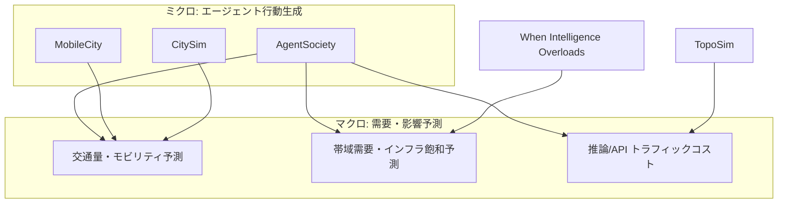

# 論文調査レポート: AgentSociety型AI社会シミュレーションとNWトラフィック需要予測・影響課題

**調査日**: 2026年7月16日  
**キーワード**: AgentSociety、AI社会シミュレーション、LLMエージェント、ネットワークトラフィック、需要予測、都市モビリティ、帯域、マルチエージェント、計算社会科学

---

## 概要

AgentSociety（清華大学 FIB Lab ほか）に代表される **LLM駆動の大規模社会シミュレーション** は、ボトムアップにエージェント行動を再現し、都市モビリティ・通信需要・インフラ負荷などの **マクロ現象を予測・評価する試金石** として急速に発展しています。本レポートでは、AgentSociety と同系統の研究のうち、**ネットワーク（NW）トラフィックの需要予測** または **通信・交通インフラへの影響課題** に直接言及する論文を **5 本** ピックアップし、`agent_instruction.md` の所定フォーマットで整理しました。

調査は arXiv・Google Scholar・Connected Papers を対象とし、補助スクリプト（`search_arxiv.py` 等）も使用しました。

主な課題領域は次のとおりです。

| 課題領域 | 内容 |
|---------|------|
| デジタルNW需要予測 | AIエージェント数の指数増加に伴う帯域需要（EB/日）のマクロ予測、エッジ・ピアリング飽和 |
| 都市交通需要予測 | LLMエージェントの移動行動から時間帯別交通量・モビリティパターンを予測 |
| シミュレーション実行コスト | 大規模エージェント社会の LLM 推論が生む API/NW トラフィック（トークン消費）の爆発 |
| 行動リアリズムと検証 | 生成エージェントの移動が実測 OD フロー・滞在時間と乖離するギャップ |
| スケーラビリティ | 1万〜20万規模のエージェントを現実的コストで回す分散・非同期アーキテクチャ |

**注記**: Google Scholar / Semantic Scholar API はレート制限・課金制限のため被引用数・Citations の自動取得に失敗しました。被引用数・Citations は「不明」とし、Connected Papers は検索 URL を記載しています。発表元は arXiv メタデータ・ACL Anthology・IEEE Xplore・論文 PDF に基づきます。

---

## ピックアップ論文（5 本）

### 1. AgentSociety: Large-Scale Simulation of LLM-Driven Generative Agents Advances Understanding of Human Behaviors and Society

**タイトル（原題）**: AgentSociety: Large-Scale Simulation of LLM-Driven Generative Agents Advances Understanding of Human Behaviors and Society

**著者**: Jinghua Piao, Yuwei Yan, Jun Zhang, Nian Li, Junbo Yan, Xiaochong Lan, Zhihong Lu, Zhiheng Zheng, Jing Yi Wang, Di Zhou, Chen Gao, Fengli Xu, Fang Zhang, Ke Rong, Jun Su, Yong Li

**公開日**: 2025年2月

**発表元（査読付き）**: 査読付き未確認（arXiv プレプリント）

**被引用数**: 不明（Google Scholar 参照不可）

**Citations（Connected Papers）**: 不明

**URL**: https://arxiv.org/abs/2502.08691

**Connected Papers**: https://www.connectedpapers.com/search?q=AgentSociety%3A%20Large-Scale%20Simulation%20of%20LLM-Driven%20Generative%20Agents

**検出ソース**: arXiv

**要約**:
LLM駆動の大規模社会シミュレータ AgentSociety を提案する基盤論文です。心理・経済・行動科学理論に基づき、感情・欲求・認知を持つ社会エージェントを設計し、都市・社会・経済の三層環境で相互作用させます。Ray 分散計算と MQTT メッセージブローカにより **1 万超エージェント・500 万相互作用** を実現。都市空間では OpenStreetMap 由来の道路網・AOI/POI を用い、SUMO/CityFlow 系の交通モデル（IDM/MOBIL、歩行・バス・タクシー）で **移動需要をミクロから生成** します。極化・ inflammatory メッセージ伝播・UBI 政策・ハリケーン等の社会実験を再現し、実世界実験との整合性を示しています。NW 影響の観点では、(1) エージェント間・環境間の大量メッセージ交換が通信負荷を生むこと、(2) 都市モビリティシミュレーションが交通需要予測の基盤となることが示唆されます。

#### 関連論文（Connected Papers / Citations 順 上位5件）

1. **Generative Agents: Interactive Simulacra of Human Behavior**
   - **著者**: Joon Sung Park, Joseph C. O'Brien, Carrie J. Cai, Meredith Ringel Morris, Percy Liang, Michael S. Bernstein
   - **公開年**: 2023
   - **発表元（査読付き）**: UIST 2023
   - **Citations**: 不明
   - **URL**: https://arxiv.org/abs/2304.03442

2. **MobileCity: An Efficient Framework for Large-Scale Urban Behavior Simulation**
   - **著者**: Xiaotong Ye, Nicolas Bougie, Toshihiko Yamasaki, Narimasa Watanabe
   - **公開年**: 2026
   - **発表元（査読付き）**: EACL 2026（Industry Track）
   - **Citations**: 不明
   - **URL**: https://arxiv.org/abs/2504.16946

3. **CitySim: Modeling Urban Behaviors and City Dynamics with Large-Scale LLM-Driven Agent Simulation**
   - **著者**: Nicolas Bougie, Narimasa Watanabe
   - **公開年**: 2025
   - **発表元（査読付き）**: EMNLP 2025（Industry Track）
   - **Citations**: 不明
   - **URL**: https://aclanthology.org/2025.emnlp-industry.15/

4. **AgentSociety Challenge: Designing LLM Agents for User Modeling and Recommendation on Web Platforms**
   - **著者**: Yuwei Yan, Yu Shang, Qingbin Zeng ほか
   - **公開年**: 2025
   - **発表元（査読付き）**: WWW 2025（Companion Proceedings）
   - **Citations**: 不明
   - **URL**: https://arxiv.org/abs/2502.18754

5. **When Plausible Is Not Realistic: Evaluating Human Mobility in LLM-Based Urban Simulation**
   - **著者**: Gustavo H. Santos, Aline Carneiro Viana, Thiago H. Silva
   - **公開年**: 2026
   - **発表元（査読付き）**: 査読付き未確認（arXiv プレプリント）
   - **Citations**: 不明
   - **URL**: https://arxiv.org/abs/2606.13835

---

### 2. When Intelligence Overloads Infrastructure: A Forecast Model for AI-Driven Bottlenecks

**タイトル（原題）**: When Intelligence Overloads Infrastructure: A Forecast Model for AI-Driven Bottlenecks

**著者**: Gamal Refai-Ahmed, Mallik Tatipamula, Victor Zhirnov, Ahmed Refaey Hussein, Abdallah Shami

**公開日**: 2025年11月

**発表元（査読付き）**: IEEE Communications Magazine（2026年掲載）

**被引用数**: 不明（Google Scholar 参照不可）

**Citations（Connected Papers）**: 不明

**URL**: https://arxiv.org/abs/2511.07265

**Connected Papers**: https://www.connectedpapers.com/search?q=When%20Intelligence%20Overloads%20Infrastructure%3A%20A%20Forecast%20Model%20for%20AI-Driven%20Bottlenecks

**検出ソース**: arXiv / IEEE Xplore

**要約**:
AgentSociety のような大規模 AI エージェント普及を前提に、**グローバルデジタルインフラの帯域需要をマクロ予測** する統合モデルを提示しています。AI エージェント数は 2026 年の約 500〜1,000 億から 2036 年に 2〜5 兆（約 100 倍）へ増加し、帯域需要は約 100 EB/日（2026）から約 8,000 EB/日（2036）へ（約 81 倍）急増すると予測されます。ボトルネックはアクセス NW、エッジゲートウェイ、ピアリング/IXP、クラウド DC に集中し、エッジ・ピアリングは 2030 年前後で飽和、2033 年までに最大容量の 70% 超利用に達するシミュレーション結果が示されています。AI-to-AI 通信・システムテレメトリ・エッジ推論が従来の人間起点トラフィックと異なる **動的・上行偏重** の特性を持つと指摘し、分散推論・AI ネイティブトラフィックエンジニアリング・インテントベースオーケストレーションを対策として提案しています。

#### 関連論文（Connected Papers / Citations 順 上位5件）

1. **FlexNGIA 2.0: Redesigning the Internet with Agentic AI**
   - **著者**: （複数著者）
   - **公開年**: 2025
   - **発表元（査読付き）**: 査読付き未確認（arXiv プレプリント）
   - **Citations**: 不明
   - **URL**: https://arxiv.org/abs/2509.02124

2. **Towards Agentic AI Networking in 6G: A Generative Foundation Model-as-Agent Approach**
   - **著者**: Yong Xiao, Guangming Shi, Ping Zhang
   - **公開年**: 2025
   - **発表元（査読付き）**: IEEE Communications Magazine（2025年9月号）
   - **Citations**: 不明
   - **URL**: https://arxiv.org/abs/2503.15764

3. **AI Agent Communications in the Future Internet—Paving a Path Toward the Agentic Web**
   - **著者**: （複数著者）
   - **公開年**: 2026
   - **発表元（査読付き）**: Future Internet（MDPI, 査読付き）
   - **Citations**: 不明
   - **URL**: https://www.mdpi.com/1999-5903/18/3/171

4. **Network and Systems Performance Characterization of MCP-Enabled LLM Agents**
   - **著者**: Zihao Ding, Mufeng Zhu, Yao Liu
   - **公開年**: 2025
   - **発表元（査読付き）**: 査読付き未確認（arXiv プレプリント）
   - **Citations**: 不明
   - **URL**: https://arxiv.org/abs/2511.07426

5. **Beyond Self-Talk: A Communication-Centric Survey of LLM-Based Multi-Agent Systems**
   - **著者**: （複数著者）
   - **公開年**: 2025
   - **発表元（査読付き）**: 査読付き未確認（arXiv プレプリント）
   - **Citations**: 不明
   - **URL**: https://arxiv.org/abs/2502.14321

---

### 3. MobileCity: An Efficient Framework for Large-Scale Urban Behavior Simulation

**タイトル（原題）**: MobileCity: An Efficient Framework for Large-Scale Urban Behavior Simulation

**著者**: Xiaotong Ye, Nicolas Bougie, Toshihiko Yamasaki, Narimasa Watanabe

**公開日**: 2025年4月

**発表元（査読付き）**: EACL 2026（Industry Track）

**被引用数**: 不明（Google Scholar 参照不可）

**Citations（Connected Papers）**: 不明

**URL**: https://arxiv.org/abs/2504.16946

**Connected Papers**: https://www.connectedpapers.com/search?q=MobileCity%3A%20An%20Efficient%20Framework%20for%20Large-Scale%20Urban%20Behavior%20Simulation

**検出ソース**: arXiv / ACL Anthology

**要約**:
AgentSociety と同系統の **都市規模 LLM エージェントシミュレーション** で、移動需要予測に特化した軽量フレームワークです。アンケート由来のペルソナを初期化し、欲求・習慣・義務の三モジュールで行動を駆動。歩行・PMV・バスの多モーダル交通網と天候・気温・施設開閉を統合します。スケーラビリティのため、非同期バッチ LLM 推論・メモリインデックス交換による低トークン通信・OpenSearch へのイベントログを採用。**4,000 エージェント** でベースラインより高い行動リアリズムと効率を実証。実用例として **モビリティパターン予測** と人口統計分析を提示し、地図セクター別の **時間帯交通量（traffic flow）** を記録する仕組みを公開しています。NW 影響の観点では、同期型マルチターン対話を避ける設計が API/NW トラフィック削減に寄与します。

#### 関連論文（Connected Papers / Citations 順 上位5件）

1. **CitySim: Modeling Urban Behaviors and City Dynamics with Large-Scale LLM-Driven Agent Simulation**
   - **著者**: Nicolas Bougie, Narimasa Watanabe
   - **公開年**: 2025
   - **発表元（査読付き）**: EMNLP 2025（Industry Track）
   - **Citations**: 不明
   - **URL**: https://aclanthology.org/2025.emnlp-industry.15/

2. **AgentSociety: Large-Scale Simulation of LLM-Driven Generative Agents Advances Understanding of Human Behaviors and Society**
   - **著者**: Jinghua Piao ほか
   - **公開年**: 2025
   - **発表元（査読付き）**: 査読付き未確認（arXiv プレプリント）
   - **Citations**: 不明
   - **URL**: https://arxiv.org/abs/2502.08691

3. **Generative Agents: Interactive Simulacra of Human Behavior**
   - **著者**: Joon Sung Park ほか
   - **公開年**: 2023
   - **発表元（査読付き）**: UIST 2023
   - **Citations**: 不明
   - **URL**: https://arxiv.org/abs/2304.03442

4. **Humanoid Agents: Platform for Simulating Human-Like Generative Agents**
   - **著者**: Zhilin Wang, Yu-Ying Chiu, Yu Cheung Chiu
   - **公開年**: 2023
   - **発表元（査読付き）**: EMNLP 2023
   - **Citations**: 不明
   - **URL**: https://aclanthology.org/2023.emnlp-main.906/

5. **When Plausible Is Not Realistic: Evaluating Human Mobility in LLM-Based Urban Simulation**
   - **著者**: Gustavo H. Santos ほか
   - **公開年**: 2026
   - **発表元（査読付き）**: 査読付き未確認（arXiv プレプリント）
   - **Citations**: 不明
   - **URL**: https://arxiv.org/abs/2606.13835

---

### 4. CitySim: Modeling Urban Behaviors and City Dynamics with Large-Scale LLM-Driven Agent Simulation

**タイトル（原題）**: CitySim: Modeling Urban Behaviors and City Dynamics with Large-Scale LLM-Driven Agent Simulation

**著者**: Nicolas Bougie, Narimasa Watanabe

**公開日**: 2025年11月

**発表元（査読付き）**: EMNLP 2025（Industry Track）

**被引用数**: 不明（Google Scholar 参照不可）

**Citations（Connected Papers）**: 不明

**URL**: https://aclanthology.org/2025.emnlp-industry.15/

**Connected Papers**: https://www.connectedpapers.com/search?q=CitySim%3A%20Modeling%20Urban%20Behaviors%20and%20City%20Dynamics

**検出ソース**: ACL Anthology / arXiv（関連プレプリント参照）

**要約**:
AgentSociety を発展させ、**数万規模の LLM エージェント** による都市ダイナミクス予測フレームワーク CitySim を提案しています。再帰的価値駆動計画で日常スケジュールを生成し、信念・長期目標・空間記憶を付与。アンケート由来ペルソナで異質な都市人口を再現します。実験では **群衆密度推定・場所人気予測・ウェルビーイング評価** を行い、時間帯別移動回数・POI 人気分布が実測に近い傾向を示すと報告。AgentSociety・MobileCity と比較し、長期認知機構と交通手段選択の統合を強調しています。都市交通需要予測の観点では、エージェント行動の集約から **マクロ交通・人流パターンをボトムアップに導出** するアプローチを示します。

#### 関連論文（Connected Papers / Citations 順 上位5件）

1. **MobileCity: An Efficient Framework for Large-Scale Urban Behavior Simulation**
   - **著者**: Xiaotong Ye ほか
   - **公開年**: 2026
   - **発表元（査読付き）**: EACL 2026（Industry Track）
   - **Citations**: 不明
   - **URL**: https://arxiv.org/abs/2504.16946

2. **AgentSociety: Large-Scale Simulation of LLM-Driven Generative Agents Advances Understanding of Human Behaviors and Society**
   - **著者**: Jinghua Piao ほか
   - **公開年**: 2025
   - **発表元（査読付き）**: 査読付き未確認（arXiv プレプリント）
   - **Citations**: 不明
   - **URL**: https://arxiv.org/abs/2502.08691

3. **CityBench: Evaluating the Capabilities of Large Language Models for Urban Tasks**
   - **著者**: Jie Feng ほか
   - **公開年**: 2025
   - **発表元（査読付き）**: KDD 2025（Datasets & Benchmarks Track）
   - **Citations**: 不明
   - **URL**: https://arxiv.org/abs/2406.13945

4. **Large Language Model Powered Intelligent Urban Agents: Concepts, Capabilities, and Applications**
   - **著者**: （複数著者）
   - **公開年**: 2025
   - **発表元（査読付き）**: 査読付き未確認（arXiv プレプリント）
   - **Citations**: 不明
   - **URL**: https://arxiv.org/abs/2507.00914

5. **GenWorld: Empirically Grounded Urban Simulation Infrastructure for Scalable LLM-Agent Studies**
   - **著者**: Gen Li ほか
   - **公開年**: 2026
   - **発表元（査読付き）**: 査読付き未確認（arXiv プレプリント）
   - **Citations**: 不明
   - **URL**: https://arxiv.org/abs/2606.27650

---

### 5. Topology-Aware LLM-Driven Social Simulation: A Unified Framework for Efficient and Realistic Agent Dynamics

**タイトル（原題）**: Topology-Aware LLM-Driven Social Simulation: A Unified Framework for Efficient and Realistic Agent Dynamics

**著者**: Yuwei Xu, Shulun Zhang, Yingli Zhou, Shipei Zeng, Laks V. S. Lakshmanan, Chenhao Ma

**公開日**: 2026年4月

**発表元（査読付き）**: 査読付き未確認（arXiv プレプリント）

**被引用数**: 不明（Google Scholar 参照不可）

**Citations（Connected Papers）**: 不明

**URL**: https://arxiv.org/abs/2604.18011

**Connected Papers**: https://www.connectedpapers.com/search?q=Topology-Aware%20LLM-Driven%20Social%20Simulation

**検出ソース**: arXiv

**要約**:
AgentSociety 型の大規模社会シミュレーションにおける **通信・推論トラフィック（LLM API 呼び出し）の爆発** を抑える TopoSim フレームワークです。社会ネットワークのトポロジを実行信号として活用し、構造的に類似したエージェントを共有推論ユニットにまとめることで、**トークン消費を 50〜90% 削減**（最大 91.7%）しつつ、極化・合意などのマクロ指標を維持します。EchoChamberSim・OASIS・FDE-LLM 上で **最大 5,000 ノード・1.5 万エッジ** のグラフを評価。AgentSociety のような 1 万超エージェント社会を現実的コストで運用する際の **NW/API 帯域・レイテンシ制約** に直接対応する研究です。デジタル NW 需要予測の観点では、エージェント数に対する推論トラフィックのスケーリング則を定量化する示唆を与えます。

#### 関連論文（Connected Papers / Citations 順 上位5件）

1. **OASIS: Open Agent Social Interaction Simulations with One Million Agents**
   - **著者**: （複数著者）
   - **公開年**: 2024
   - **発表元（査読付き）**: 査読付き未確認（arXiv プレプリント）
   - **Citations**: 不明
   - **URL**: https://arxiv.org/abs/2411.11581

2. **AgentSociety: Large-Scale Simulation of LLM-Driven Generative Agents Advances Understanding of Human Behaviors and Society**
   - **著者**: Jinghua Piao ほか
   - **公開年**: 2025
   - **発表元（査読付き）**: 査読付き未確認（arXiv プレプリント）
   - **Citations**: 不明
   - **URL**: https://arxiv.org/abs/2502.08691

3. **Beyond Self-Talk: A Communication-Centric Survey of LLM-Based Multi-Agent Systems**
   - **著者**: （複数著者）
   - **公開年**: 2025
   - **発表元（査読付き）**: 査読付き未確認（arXiv プレプリント）
   - **Citations**: 不明
   - **URL**: https://arxiv.org/abs/2502.14321

4. **Understanding the Information Propagation Effects of Communication Topologies in LLM-based Multi-Agent Systems**
   - **著者**: Xu Shen ほか
   - **公開年**: 2025
   - **発表元（査読付き）**: EMNLP 2025
   - **Citations**: 不明
   - **URL**: https://arxiv.org/abs/2505.23352

5. **Towards a Science of Scaling Agent Systems**
   - **著者**: （複数著者）
   - **公開年**: 2025
   - **発表元（査読付き）**: 査読付き未確認（arXiv プレプリント）
   - **Citations**: 不明
   - **URL**: https://arxiv.org/abs/2512.08296

---

## 課題の整理

| 課題領域 | 代表的な指摘 | 関連論文 |
|---------|------------|---------|
| デジタルNW需要予測 | エージェント数約100倍増で帯域需要約81倍、2030年前後にエッジ・ピアリング飽和 | Refai-Ahmed et al. (2511.07265) |
| 都市交通需要予測 | エージェント移動行動の集約から時間帯別交通量・OD フローを予測 | Ye et al. (2504.16946), Bougie & Watanabe (EMNLP 2025) |
| 社会シミュレーション基盤 | 1万超エージェント・都市道路網・多モーダル移動を統合したボトムアップ環境 | Piao et al. (2502.08691) |
| シミュレーション実行コスト | 大規模 LLM 社会シミュレーションのトークン/API トラフィックがボトルネック | Xu et al. (2604.18011) |
| 行動リアリズム | ナラティブは妥当でも OD フロー・滞在時間が実測と乖離 | Santos et al. (2606.13835) |
| スケーラビリティ | 非同期バッチ推論・トポロジ認識協調でコスト削減 | Ye et al., Xu et al. |

---

## 研究動向の整理

---

## まとめ

1. **AgentSociety は社会実験と都市交通シミュレーションを統合した基盤** であり、LLM エージェントのボトムアップ行動から移動需要・情報伝播を生成できる。
2. **デジタル NW 需要予測** は AgentSociety 型シミュレーションのマクロ帰結として、エージェント数増加に伴う帯域需要の指数成長（Refai-Ahmed et al., IEEE Communications Magazine 2026）が最も直接的な研究線である。
3. **都市交通需要予測** は MobileCity・CitySim が先行し、時間帯別交通量・群衆密度・POI 人気をエージェント集約から導出する。
4. **シミュレーション自体の NW/API 負荷** は TopoSim がトポロジ認識協調で 50〜90% 削減を実証し、大規模社会シミュレーション運用の実務的課題を扱う。
5. **推奨読書順**: 基盤（AgentSociety）→ 都市需要予測（MobileCity / CitySim）→ デジタル NW マクロ予測（Refai-Ahmed et al.）→ 実行コスト最適化（TopoSim）

---

## 補足参考文献（ピックアップ5本以外）

| 論文 | 発表元 | URL | NW/需要予測への関連 |
|------|--------|-----|-------------------|
| GenWorld: Empirically Grounded Urban Simulation Infrastructure for Scalable LLM-Agent Studies | 査読付き未確認（arXiv） | https://arxiv.org/abs/2606.27650 | 19.6万住民規模の都市シミュレーション基盤、交通・避難需要予測を将来課題として明示 |
| When Plausible Is Not Realistic: Evaluating Human Mobility in LLM-Based Urban Simulation | 査読付き未確認（arXiv） | https://arxiv.org/abs/2606.13835 | AgentSociety/CitySim の移動リアリズム検証、交通シミュレーション連携 |
| TrafficSimAgent: A Hierarchical Agent Framework for Autonomous Traffic Simulation with MCP Control | 査読付き未確認（arXiv） | https://arxiv.org/abs/2512.20996 | LLM エージェントによる SUMO 交通需要生成・最適化 |
| Decoupled Intelligence: A Multi-Agent LLM Framework for Controllable Traffic Scenario Generation in SUMO | 査読付き未確認（arXiv） | https://arxiv.org/abs/2605.27685 | Demand/Runner/Analyst 役割分担で交通シナリオ需要を自動生成 |
| Large Language Model Powered Intelligent Urban Agents: Concepts, Capabilities, and Applications | 査読付き未確認（arXiv） | https://arxiv.org/abs/2507.00914 | AgentSociety を含む都市エージェント調査、交通渋滞の創発を言及 |
