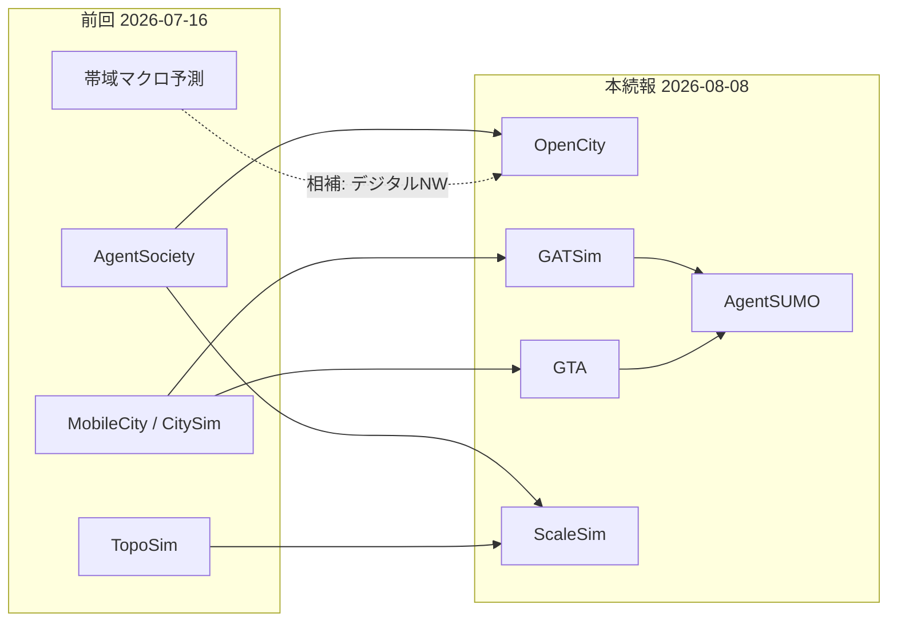

# 論文調査レポート: AgentSociety型AI社会シミュレーションとNW需要予測・影響課題（続報）

**調査日**: 2026年8月8日  
**キーワード**: AgentSociety、AI社会シミュレーション、LLMエージェント、ネットワークトラフィック、需要予測、都市モビリティ、帯域、OpenCity、GATSim、ScaleSim  
**位置づけ**: 2026-07-16 レポート（[reports/2026-07-16_AI社会シミュレーションNW需要予測.md](2026-07-16_AI社会シミュレーションNW需要予測.md)）の **続報**。前回ピックアップ5本およびその補足表と **重複しない** 論文のみを対象とする。

---

## 概要

前回調査では AgentSociety・MobileCity・CitySim・TopoSim・When Intelligence Overloads Infrastructure を中心に整理しました。本続報では、同テーマで **未掲載だった** 研究を新たに **5 本** ピックアップします。

調査ソースは arXiv・Google Scholar・Connected Papers です（補助スクリプト `search_arxiv.py` / `search_connected_papers.py` を使用）。

| 課題領域 | 本続報での焦点 |
|---------|----------------|
| LLMリクエスト/通信オーバーヘッド | 大規模都市シミュレーション時の API・TCP 待ち時間削減（OpenCity） |
| 都市交通需要・マクロ交通パターン | 生成エージェントから OD・交通流を創発（GATSim, GTA） |
| 政策対話型の需要シナリオ生成 | 自然言語→SUMO 需要・政策実験への変換（AgentSUMO） |
| シミュレーション基盤の I/O・帯域 | AgentSociety 規模の GPU メモリ/転送ボトルネック（ScaleSim） |

**除外（前回レポート掲載済み）**: AgentSociety (2502.08691)、When Intelligence Overloads Infrastructure (2511.07265)、MobileCity (2504.16946)、CitySim、TopoSim (2604.18011)、および前回補足表の GenWorld / When Plausible Is Not Realistic / TrafficSimAgent / Decoupled Intelligence 等。

**注記**: Google Scholar / Semantic Scholar API は制限のため被引用数・Citations の自動取得に失敗しました。被引用数・Citations は「不明」、Connected Papers は検索 URL を記載しています。発表元は arXiv コメント・ACL/ACM/IEEE・ジャーナル DOI に基づきます。

---

## ピックアップ論文（5 本）

### 1. OpenCity: A Scalable Platform to Simulate Urban Activities with Massive LLM Agents

**タイトル（原題）**: OpenCity: A Scalable Platform to Simulate Urban Activities with Massive LLM Agents

**著者**: Yuwei Yan, Qingbin Zeng, Zhiheng Zheng, Jingzhe Yuan, Jie Feng, Jun Zhang, Fengli Xu, Yong Li

**公開日**: 2024年10月

**発表元（査読付き）**: 査読付き未確認（arXiv プレプリント / Under review）

**被引用数**: 不明（Google Scholar 参照不可）

**Citations（Connected Papers）**: 不明

**URL**: https://arxiv.org/abs/2410.21286

**Connected Papers**: https://www.connectedpapers.com/search?q=OpenCity%3A%20A%20Scalable%20Platform%20to%20Simulate%20Urban%20Activities%20with%20Massive%20LLM%20Agents

**検出ソース**: arXiv

**要約**:
AgentSociety と同系統の清華大学 FIB Lab 系研究で、**大量 LLM エージェントによる都市活動シミュレーション** のスケーラビリティに焦点を当てた基盤です。商用 LLM API 利用時の **ネットワーク伝送遅延**（応答待ち・TCP コネクション再確立）がボトルネックになると明示し、epoll ベースの IO 多重化スケジューラとコネクションプールで通信オーバーヘッドを削減。さらに “group-and-distill” プロンプト最適化で類似属性エージェントをクラスタ化し、**LLM リクエスト約 70% 減・トークン約 50% 減・エージェントあたり約 600 倍高速化** を報告。一般ハードウェアで 1 万エージェントの 1 日活動を約 1 時間で実行可能にします。世界 6 都市で **OD 行列・回遊半径・分離指数** を実測と比較するベンチマークを初めて構築し、都市需要予測の検証基盤としても機能します。

#### 関連論文（Connected Papers / Citations 順 上位5件）

1. **Generative Agents: Interactive Simulacra of Human Behavior**
   - **著者**: Joon Sung Park ほか
   - **公開年**: 2023
   - **発表元（査読付き）**: UIST 2023
   - **Citations**: 不明
   - **URL**: https://arxiv.org/abs/2304.03442

2. **OASIS: Open Agent Social Interaction Simulations with One Million Agents**
   - **著者**: （複数著者）
   - **公開年**: 2024
   - **発表元（査読付き）**: 査読付き未確認（arXiv プレプリント）
   - **Citations**: 不明
   - **URL**: https://arxiv.org/abs/2411.11581

3. **AgentSociety Challenge: Designing LLM Agents for User Modeling and Recommendation on Web Platforms**
   - **著者**: Yuwei Yan ほか
   - **公開年**: 2025
   - **発表元（査読付き）**: WWW 2025（Companion Proceedings）
   - **Citations**: 不明
   - **URL**: https://arxiv.org/abs/2502.18754

4. **Humanoid Agents: Platform for Simulating Human-Like Generative Agents**
   - **著者**: Zhilin Wang, Yu-Ying Chiu, Yu Cheung Chiu
   - **公開年**: 2023
   - **発表元（査読付き）**: EMNLP 2023
   - **Citations**: 不明
   - **URL**: https://aclanthology.org/2023.emnlp-main.906/

5. **SUMO-MCP: Leveraging the Model Context Protocol for Autonomous Traffic Simulation and Optimization**
   - **著者**: （複数著者）
   - **公開年**: 2025
   - **発表元（査読付き）**: CAC 2025（IEEE, 査読付き）
   - **Citations**: 不明
   - **URL**: https://arxiv.org/abs/2506.03548

---

### 2. GATSim: Urban Mobility Simulation with Generative Agents

**タイトル（原題）**: GATSim: Urban Mobility Simulation with Generative Agents

**著者**: Qi Liu, Can Li, Wanjing Ma

**公開日**: 2025年6月（ジャーナル掲載 2026年）

**発表元（査読付き）**: Transportation Research Part C: Emerging Technologies, Vol. 186, 105576（2026）

**被引用数**: 不明（Google Scholar 参照不可）

**Citations（Connected Papers）**: 不明

**URL**: https://arxiv.org/abs/2506.23306

**Connected Papers**: https://www.connectedpapers.com/search?q=GATSim%3A%20Urban%20Mobility%20Simulation%20with%20Generative%20Agents

**検出ソース**: arXiv / Google Scholar（ジャーナル DOI 確認）

**要約**:
従来のルールベース都市交通 ABM では表現しにくい適応的な移動意思決定を、**認知構造を持つ生成エージェント** で再現する GATSim を提案しています。都市モビリティ基盤モデル・エージェント認知・交通シミュレーション環境を統合し、階層メモリ（時空間連想）、計画・反応機構、マルチスケール反射で経験を一般化します。実験ではロールプレイで人間注釈者と競争的な性能を示しつつ、**現実的なマクロ交通パターンが自然に創発** することを報告。交通需要予測・インフラ政策評価に向け、AgentSociety 型社会シミュレーションを **交通工学ジャーナルの本流** に接続した重要文献です。

#### 関連論文（Connected Papers / Citations 順 上位5件）

1. **MATSim: Multi-Agent Transport Simulation**
   - **著者**: Andreas Horni, Kai Nagel, Kay W. Axhausen（編）
   - **公開年**: 2016
   - **発表元（査読付き）**: Ubiquity Press（書籍 / 査読付き学術出版）
   - **Citations**: 不明
   - **URL**: https://www.matsim.org/

2. **Generative Agents: Interactive Simulacra of Human Behavior**
   - **著者**: Joon Sung Park ほか
   - **公開年**: 2023
   - **発表元（査読付き）**: UIST 2023
   - **Citations**: 不明
   - **URL**: https://arxiv.org/abs/2304.03442

3. **ChatSUMO: Large Language Model for Automating Traffic Scenario Generation in Simulation of Urban MObility**
   - **著者**: （複数著者）
   - **公開年**: 2024
   - **発表元（査読付き）**: 査読付き未確認（arXiv プレプリント）
   - **Citations**: 不明
   - **URL**: https://arxiv.org/abs/2410.18028

4. **LLMLight: Large Language Models as Traffic Signal Control Agents**
   - **著者**: Siqi Lai ほか
   - **公開年**: 2025
   - **発表元（査読付き）**: KDD 2025
   - **Citations**: 不明
   - **URL**: https://arxiv.org/abs/2402.10149

5. **SUMO – Simulation of Urban MObility: An Overview**
   - **著者**: Michael Behrisch ほか
   - **公開年**: 2011
   - **発表元（査読付き）**: SIMUL 2011
   - **Citations**: 不明
   - **URL**: https://elib.dlr.de/104795/

---

### 3. GTA: Generative Traffic Agents for Simulating Realistic Mobility Behavior

**タイトル（原題）**: GTA: Generative Traffic Agents for Simulating Realistic Mobility Behavior

**著者**: Simon Lämmer, Mark Colley, Patrick Ebel

**公開日**: 2026年1月

**発表元（査読付き）**: CHI 2026（条件付き受理 / Conditionally accepted）

**被引用数**: 不明（Google Scholar 参照不可）

**Citations（Connected Papers）**: 不明

**URL**: https://arxiv.org/abs/2601.16778

**Connected Papers**: https://www.connectedpapers.com/search?q=GTA%3A%20Generative%20Traffic%20Agents%20for%20Simulating%20Realistic%20Mobility%20Behavior

**検出ソース**: arXiv

**要約**:
国勢調査ベースの社会人口統計からペルソナを生成し、**LLM 駆動の Generative Traffic Agents（GTA）** が活動スケジュールと交通手段選択を行う枠組みです。Berlin 規模の実験で SUMO と統合し、実測交通量・移動調査（Mobility in Germany 2017）と照合。社会経済属性別のモーダルスプリット等のパターンを再現する一方、トリップ長や手段選好に系統的バイアスがあることも報告しています。従来の固定効用関数に依存しないため、新技術・政策の早期評価向け需要予測に適し、AgentSociety 型の社会行動生成を **実証的な都市交通需要シミュレーション** に接続する HCI/交通交差研究です。

#### 関連論文（Connected Papers / Citations 順 上位5件）

1. **Generative Agents: Interactive Simulacra of Human Behavior**
   - **著者**: Joon Sung Park ほか
   - **公開年**: 2023
   - **発表元（査読付き）**: UIST 2023
   - **Citations**: 不明
   - **URL**: https://arxiv.org/abs/2304.03442

2. **ChatSUMO: Large Language Model for Automating Traffic Scenario Generation in Simulation of Urban MObility**
   - **著者**: （複数著者）
   - **公開年**: 2024
   - **発表元（査読付き）**: 査読付き未確認（arXiv プレプリント）
   - **Citations**: 不明
   - **URL**: https://arxiv.org/abs/2410.18028

3. **A Large-Scale Traffic Scenario for SUMO from Berlin MATSim**
   - **著者**: Dominik Schrab ほか
   - **公開年**: 2023
   - **発表元（査読付き）**: SUMO Conference Proceedings 等
   - **Citations**: 不明
   - **URL**: https://www.eclipse.dev/sumo/

4. **Speak to Simulate: An LLM-Guided Agentic Framework for Traffic Simulation in SUMO**
   - **著者**: Minwoo Jeong, Jeeyun Chang, Yoonjin Yoon
   - **公開年**: 2025
   - **発表元（査読付き）**: GeoSim@ACM SIGSPATIAL 2025
   - **Citations**: 不明
   - **URL**: https://doi.org/10.1145/3764921.3770151

5. **Evaluating Large Language Models for Decision-Making in Agent-Based Urban Mobility Simulations**
   - **著者**: Bruno Cascaes Alves
   - **公開年**: 2026
   - **発表元（査読付き）**: 査読付き未確認（arXiv プレプリント）
   - **Citations**: 不明
   - **URL**: https://arxiv.org/abs/2607.02716

---

### 4. AgentSUMO: An Agentic Framework for Interactive Simulation Scenario Generation in SUMO via Large Language Models

**タイトル（原題）**: AgentSUMO: An Agentic Framework for Interactive Simulation Scenario Generation in SUMO via Large Language Models  
（関連査読版: Speak to Simulate: An LLM-Guided Agentic Framework for Traffic Simulation in SUMO）

**著者**: Minwoo Jeong, Jeeyun Chang, Yoonjin Yoon

**公開日**: 2025年11月（arXiv）/ 2025年（ACM Workshop）

**発表元（査読付き）**: GeoSim@ACM SIGSPATIAL 2025（Speak to Simulate）；拡張版は Transportation Research Part C 投稿中（arXiv コメント）

**被引用数**: 不明（Google Scholar 参照不可）

**Citations（Connected Papers）**: 不明

**URL**: https://arxiv.org/abs/2511.06804

**Connected Papers**: https://www.connectedpapers.com/search?q=AgentSUMO%3A%20An%20Agentic%20Framework%20for%20Interactive%20Simulation%20Scenario%20Generation%20in%20SUMO

**検出ソース**: arXiv / ACM Digital Library

**要約**:
抽象的な政策目標（例: 「渋滞を減らせ」）を、**Interactive Planning Protocol** と **MCP** により実行可能な SUMO シナリオへ変換するエージェント枠組みです。ネットワーク構築・OD/需要生成・信号制御・結果分析をツール群でオーケストレーションし、Seoul・Manhattan の都市網で交通流 KPI の改善を示します。前回補足にあった TrafficSimAgent / Decoupled Intelligence と同系統ですが、**対話的意図解釈と不足パラメータ推論** に重点があり、非専門家による需要シナリオ生成・政策実験の障壁を下げる点で、AI 社会シミュレーションの成果を実務的な交通需要評価へ接続する橋渡し論文です。

#### 関連論文（Connected Papers / Citations 順 上位5件）

1. **SUMO-MCP: Leveraging the Model Context Protocol for Autonomous Traffic Simulation and Optimization**
   - **著者**: （複数著者）
   - **公開年**: 2025
   - **発表元（査読付き）**: CAC 2025（IEEE）
   - **Citations**: 不明
   - **URL**: https://arxiv.org/abs/2506.03548

2. **ChatSUMO: Large Language Model for Automating Traffic Scenario Generation in Simulation of Urban MObility**
   - **著者**: （複数著者）
   - **公開年**: 2024
   - **発表元（査読付き）**: 査読付き未確認（arXiv プレプリント）
   - **Citations**: 不明
   - **URL**: https://arxiv.org/abs/2410.18028

3. **LLMLight: Large Language Models as Traffic Signal Control Agents**
   - **著者**: Siqi Lai ほか
   - **公開年**: 2025
   - **発表元（査読付き）**: KDD 2025
   - **Citations**: 不明
   - **URL**: https://arxiv.org/abs/2402.10149

4. **GTA: Generative Traffic Agents for Simulating Realistic Mobility Behavior**
   - **著者**: Simon Lämmer, Mark Colley, Patrick Ebel
   - **公開年**: 2026
   - **発表元（査読付き）**: CHI 2026（条件付き受理）
   - **Citations**: 不明
   - **URL**: https://arxiv.org/abs/2601.16778

5. **Decoupled Intelligence: A Multi-Agent LLM Framework for Controllable Traffic Scenario Generation in SUMO**
   - **著者**: Shuyang Li, Ruimin Ke
   - **公開年**: 2026
   - **発表元（査読付き）**: 査読付き未確認（arXiv プレプリント）
   - **Citations**: 不明
   - **URL**: https://arxiv.org/abs/2605.27685

---

### 5. ScaleSim: Serving Large-Scale Multi-Agent Simulation with Invocation Distance-Based Memory Management

**タイトル（原題）**: ScaleSim: Serving Large-Scale Multi-Agent Simulation with Invocation Distance-Based Memory Management

**著者**: Zaifeng Pan, Yipeng Shen, Zhengding Hu, Zhuang Wang, Aninda Manocha, Zheng Wang, Zhongkai Yu, Yue Guan, Yufei Ding

**公開日**: 2026年1月

**発表元（査読付き）**: ICML 2026

**被引用数**: 不明（Google Scholar 参照不可）

**Citations（Connected Papers）**: 不明

**URL**: https://arxiv.org/abs/2601.21473

**Connected Papers**: https://www.connectedpapers.com/search?q=ScaleSim%3A%20Serving%20Large-Scale%20Multi-Agent%20Simulation%20with%20Invocation%20Distance-Based%20Memory%20Management

**検出ソース**: arXiv / ICML 2026

**要約**:
AgentSociety をはじめとする大規模マルチエージェント社会シミュレーションでは、エージェントごとのモデル状態・プレフィックスキャッシュ・アダプタが GPU メモリを逼迫し、**CPU–GPU 転送（I/O 帯域）** がスループットを支配します。ScaleSim は「疎なエージェント活性化」と「推定可能な呼び出し順序」に着目し、**invocation distance** に基づく prefetch・優先度付き eviction・実行プリエンプションを導入。SGLang 上に実装し、**AgentSociety・Generative Agents 型相互作用・情報拡散ネットワーク** の 3 ワークロードで評価、最大 **1.74×** の高速化を報告します。社会シミュレーションが生む推論/ストレージ NW 需要そのものをシステム側で抑える、前回の TopoSim（トークン協調）と相補的な基盤研究です。

#### 関連論文（Connected Papers / Citations 順 上位5件）

1. **SGLang: Efficient Execution of Structured Language Model Programs**
   - **著者**: Lianmin Zheng ほか
   - **公開年**: 2024
   - **発表元（査読付き）**: NeurIPS 2024
   - **Citations**: 不明
   - **URL**: https://arxiv.org/abs/2312.07104

2. **vLLM: Easy, Fast, and Cheap LLM Serving with PagedAttention**
   - **著者**: Woosuk Kwon ほか
   - **公開年**: 2023
   - **発表元（査読付き）**: SOSP 2023
   - **Citations**: 不明
   - **URL**: https://arxiv.org/abs/2309.06180

3. **Generative Agents: Interactive Simulacra of Human Behavior**
   - **著者**: Joon Sung Park ほか
   - **公開年**: 2023
   - **発表元（査読付き）**: UIST 2023
   - **Citations**: 不明
   - **URL**: https://arxiv.org/abs/2304.03442

4. **Agentopia: Long-Term Life Simulation and Learning in Agent Societies**
   - **著者**: Xintao Wang ほか
   - **公開年**: 2026
   - **発表元（査読付き）**: 査読付き未確認（arXiv プレプリント）
   - **Citations**: 不明
   - **URL**: https://arxiv.org/abs/2606.07513

5. **OpenCity: A Scalable Platform to Simulate Urban Activities with Massive LLM Agents**
   - **著者**: Yuwei Yan ほか
   - **公開年**: 2024
   - **発表元（査読付き）**: 査読付き未確認（arXiv プレプリント）
   - **Citations**: 不明
   - **URL**: https://arxiv.org/abs/2410.21286

---

## 課題の整理（続報）

| 課題領域 | 代表的な指摘 | 関連論文 |
|---------|------------|---------|
| API/通信オーバーヘッド | LLM API の応答待ち・TCP 再接続が都市シミュレーションを律速。IO 多重化でリクエスト約70%削減 | OpenCity (2410.21286) |
| マクロ交通創発 | 認知付き生成エージェントから現実的なマクロ交通パターンが創発 | GATSim (TRC 2026) |
| 実証的需要予測 | 国勢調査ペルソナ＋SUMO で Berlin 規模の手段選択・交通流を検証 | GTA (CHI 2026) |
| 政策→需要シナリオ | 自然言語政策目標から OD/需要・信号実験を自動生成 | AgentSUMO / Speak to Simulate |
| 推論基盤 I/O | AgentSociety 規模で GPU メモリと CPU–GPU 帯域がボトルネック。1.74×高速化 | ScaleSim (ICML 2026) |
| 長期社会シミュレーションコスト | 100 エージェント×10 年で約 13.7B トークン・567K 呼び出し（補足） | Agentopia (2606.07513) |

---

## 前回レポートとの関係

---

## まとめ

1. **OpenCity** は AgentSociety 系の都市シミュレーションを、LLM API の **通信オーバーヘッド削減** と OD ベンチマークで実務スケールに近づける。
2. **GATSim / GTA** は生成エージェントから **実証可能な都市交通需要・マクロ交通流** を導く線で、交通工学・HCI の査読付き会場（TRC / CHI）に到達している。
3. **AgentSUMO** は政策意図から SUMO 需要シナリオを対話的に生成し、シミュレーション成果の意思決定利用を加速する。
4. **ScaleSim** は AgentSociety を直接ベンチマークし、社会シミュレーション実行時の **GPU/メモリ I/O 帯域** を最適化する（前回 TopoSim のトークン削減と相補）。
5. **推奨読書順（続報）**: OpenCity → GATSim → GTA → AgentSUMO → ScaleSim。前回レポートと併読すると、デジタル NW マクロ予測から都市交通需要・実行基盤までが一通りつながる。

---

## 補足参考文献（本続報のピックアップ5本以外・前回とも非重複）

| 論文 | 発表元 | URL | NW/需要予測への関連 |
|------|--------|-----|-------------------|
| Agentopia: Long-Term Life Simulation and Learning in Agent Societies | 査読付き未確認（arXiv） | https://arxiv.org/abs/2606.07513 | 100エージェント×10年で約13.7Bトークン。長期社会シミュレーションの API/NW コスト定量化 |
| SUMO-MCP: Leveraging the Model Context Protocol for Autonomous Traffic Simulation and Optimization | CAC 2025（IEEE） | https://arxiv.org/abs/2506.03548 | MCP 経由で OD/需要生成と信号最適化を自動化 |
| ChatSUMO: Large Language Model for Automating Traffic Scenario Generation in SUMO | 査読付き未確認（arXiv） | https://arxiv.org/abs/2410.18028 | 自然言語からの交通シナリオ・需要生成の先駆 |
| LLMLight: Large Language Models as Traffic Signal Control Agents | KDD 2025 | https://arxiv.org/abs/2402.10149 | LLM エージェントによる信号制御とネットワーク性能 |
| Evaluating Large Language Models for Decision-Making in Agent-Based Urban Mobility Simulations | 査読付き未確認（arXiv） | https://arxiv.org/abs/2607.02716 | 都市モビリティ ABM における LLM 意思決定の評価 |
| DG-LLM: Decomposition-based dynamic graph adaptation of LLMs for spatiotemporal traffic forecasting | PLOS ONE（査読付き） | https://doi.org/10.1371/journal.pone.0349527 | LLM×動的グラフによる時空間交通予測（社会シミュレーションとは別系統だが需要予測に直結） |
